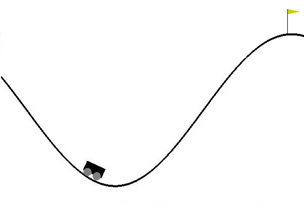
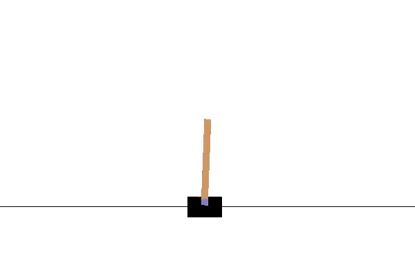

# OpenAI-Gym (https://gym.openai.com/)

This project was written as a homework assignment for the Artificial Intelligence class (CAP-5636) at the University of Central Florida. It contains simple implementations utilizing OpenAi-Gym environments. The OpenAI-Gym package for Python can be installed using:

    pip install gym

# 01_mountain_car_policy.ipynb

The goal of this exercise is to determine a policy that will allow the car to climb the mountain by building up momentum. The farther to the right the car climbs, the higher the score.

# 02_cart_pole_policy.ipynb

The goal of this exercise is to determine a policy that will maintain balance the pole on the cart for as long as possible. A maximum of 200 steps is used, but that number can be set arbitrarily high for longer trials.

# 03_mountain_car_policy.ipynb

This exercise reuses the MountainCar environment, but the policy is determined using a neural network.

# 04_algorithms_methods_overview.ipynb

The last part of this assignment was simply to define a number of terms used with AI. There is no code for this notebok.
